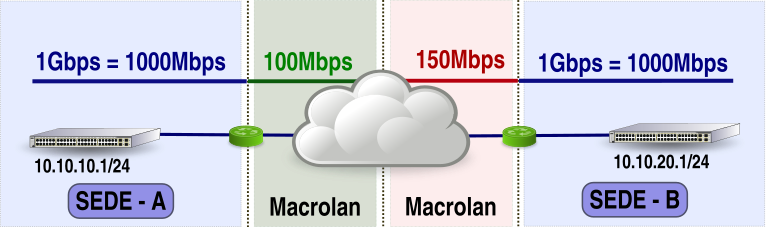
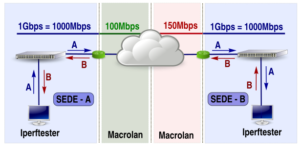

# Iperftester

Iperftester es una distribución `Live` basada en [**Debian**](https://www.debian.org/) para medir el ancho de banda (`throughput`) y calidad de enlaces de red mediante [**iperf**](https://sourceforge.net/projects/iperf2/) / [**iperf3**](http://software.es.net/iperf/) 

```
Este repositorio contiene solamente los scripts Bash.
```

Puede descargar la distribución `Live` [**Iperftester_01r03.iso**](http://delegacionprovincial.com/iperftester/iperftester_v01_r03.iso) con los scripts y todas las herramientas necesarias para poder realizar tests desde un DVD, CD o Pendrive.

```
Ver apartado 'Notas sobre imagen ISO'
``` 

El enlace a examinar se delimita por dos equipos ejecutando `iperftester` donde uno actúa como cliente y otro como servidor.

```
Un equipo ejecutanto 'iperftester' puede actuar como cliente o servidor.
```


Al iniciar `iperftester` se arrancan 4 programas:
 
| Comando | Programa | Puerto |
| --- | --- | ---- |
| `iperf3` | Programa Cliente-Servidor para crear flujos de datos `TCP/UDP/SCTP` | **5201** |
| `iperf` | Programa Cliente-Servidor para crear flujos de datos  `TCP` | **5001** |
| `iperf` | Programa Cliente-Servidor para crear flujos de datos `UDP` | **5002** |
| `ssh` | Programa Servidor para acceder a maquinas remotas mediante `SSH` | **22** |
 
Los servidores `iperf`/`iperf3` se utilizan para realizar los tests  y el servidor `ssh` para poder controlar remotamente los equipos que están ejecutando `iperftester`.

```
Pueden realizarse tests de forma automática donde solamente es necesario introducir ip/mascara/gateway
```

## Perfiles de uso:

### usuario: iperf

Permite realizar tests de forma interactiva, controlar parametros de ejecución (puertos, tiempo, intervalo, etc.), consultar resultados y exportarlos a unidades externas (pendrive) o remotas (sftp).

### usuario: root     

Si necesita instalar nuevas herramientas y utiliza un proxy para acceder a internet necesita exportar la variables `http_proxy` y `https_proxy`:

- export http_proxy="http://usuario:password@ip_del_proxy:puerto_del_proxy"  
- export https_proxy="http://usuario:password@ip_del_proxy:puerto_del_proxy" 

## Caso de uso ##

### Escenario 

Se desea medir el `throughput` y calidad de enlaces entre dos sedes:
ort to receive bidirectional tests back on

- Sede A: Red interna a 1Gbps/1000Mbps con conexión Macrolan 100Mbps 
- Sede B: Red interna a 1Gbps/1000Mbps con conexión Macrolan 150Mbps  



### Solución basada en iperftester

El `throughput` máximo en este escenario será el del enlace con menor ancho de banda (`Macrolan de 100Mbps`)

Para realizar los tests es necesario iniciar `iperftester` en un equipo de la Sede A y otro de la Sede B:

1. Iniciar **iperftester** en la Sede A con el usuario **iperf** (Configurar Ip/Máscara/Gateway)
2. Iniciar **iperftester** en la Sede B con el usuario **iperf** (Configurar Ip/Máscara/Gateway)
3. Ejecutar la opción **Auto** en cualquiera de las sedes para realizar los tests de forma automática
4. Consultar los resultados con la opción **Ver** o exportar a una unidad externa con la opción **Pendrive**




Al seleccionar la opción `Auto` en la Sede A se ejecutarán los siguientes comandos:

| Commando | Detalle |
| --- | --- |
| `ping` | Desde Sede A a Sede B |
| `traceroute` | Desde Sede A a Sede B |
| `iperf3` | Inyectar tráfico TCP desde Sede A a Sede B (Tráfico de color azul) |
| `iperf3` | Inyectar tráfico TCP desde Sede B a Sede A  (Tráfico de color rojo) |
| `iperf3` | Inyectar tráfico UDP desde Sede A a Sede B (Tráfico de color azul) |
| `iperf3` | Inyectar tráfico UDP desde Sede B a Sede A  (Tráfico de color rojo) |
   
Ejemplo de un fichero de log obtenido en la Sede A con los resultados de un test realizado con la opción **Auto** [**20180222_122551_Macrolan_100M.log**](use_case/20180222_122551_Macrolan_100M.log)

## Otros usos

### Cambio de puertos

Es posible comprobar la conectividad entre dos puntos mediante un puerto, por ejemplo arrancando un servidor `iperf`/`iperf3` en el puerto `3306` podemos comprobar que no existen filtros intermedios (firewall) entre un equipo y un servidor Mysql.

## Notas sobre imagen ISO

La imagen ISO dispone de 3 opciones de arranque:

- Iperftester (vga=791)
   - **vga=791** cambia resolución de pantalla a 1024x768 y 16 bits
- Iperftester (PAE vga=794) 
   - **PAE**  Equipos con mas de 3Gb de memoria RAM
   - **vga=794** cambia resolución de pantalla a 1280x1024 y 16 bits
- Detectar Hardware

```
Para cambiar parámetros (ejemplo vga=798) debe utilizar el tabulador sobre la opción de arranque
```

Si utiliza software de virtualización para arrancar la imagen ISO debe configurar la tarjeta de red como `bridge` (adaptador puente).

### Resoluciones vga

A continuación de detallan algunas `resoluciones vga` que pueden seleccionarse al arrancar la imagen ISO

| Depth | 800×600 | 1024×768 | 1152×864 | 1280×1024 | 1600×1200 |
| ---- | ---- | ---- | ---- | ---- | ---- |  
| 8 bit | vga=771 | vga=773 | vga=353 |	vga=775 | vga=796 |
| 16 bit | vga=788 | vga=791 | vga=355 |	vga=794 | vga=798 |
| 24 bit | vga=789 | vga=792 | | vga=795 | vga=799 |

## Roadmap

### Version 1 (febrero 2018):

- Iperftester `Live`
   - Medir ancho de banda y calidad de enlaces
   - Automatizar pruebas
   - Crear ficheros de log con los resultados.
   - Controlar parametros de ejecución
   - Exportar resultados 

### Versión 2:

- Programación horaria de pruebas iperf / iperf3
- APIRest
   - Descarga resultados iperf / iperf3 (Json)
   - Consultar tráfico E/S (mirror / sflow) 
   - Documentación Swagger
- Facilitar despliegue (Contenedores LXD)

### Versión 3 - 4:
- Modo sonda / colector
- Colector Sflow para visualizar tráfico E/S en tiempo real 
- Monitorizar sondas mediante (Icinga/Nagios)
- Paneles con tráfico E/S (Grafana y Mediawiki) https://github.com/fmbrieva/mediawiki-grafana
- Herramienta Web para centralizar resultados y controlar sondas
- Facilitar despliegue de sondas (Docker)

## Releases

### 2018-02-24 (01r00)
- Versión inicial

### 2018-02-28 (01r01)
- Idioma español en lang/es

### 2018-03-03 (01r02)
- Compilar nueva versión iperf 3.5+ publicada el 2018-03-02 

### 2018-03-08 (01r03)
- Añadir **Listen Port** para test bidireccionales en iperf version 2
- Permitir cambiar binarios `iperf` para tests en modo Auto, TCP y UDP
   - iperf 2.0.10 (versión 2)
   - iperf 3.5+ (versión 3)

## Créditos

### Version 1:
- [**Debian**](https://www.debian.org/)
- [**iperf**](https://sourceforge.net/projects/iperf2/)
- [**iperf3**](http://software.es.net/iperf/)

### Versión 2:
- [**Swagger**](https://swagger.io/)
- [**LXD - Linux container**](https://linuxcontainers.org/lxd/)

### Versión 3 - 4:
- [**Grafana**](https://grafana.com/)
- [**Mediawiki**](https://www.mediawiki.org/wiki/MediaWiki)
- [**Icinga**](https://www.icinga.com/)
- [**Docker**](https://www.docker.com/)
